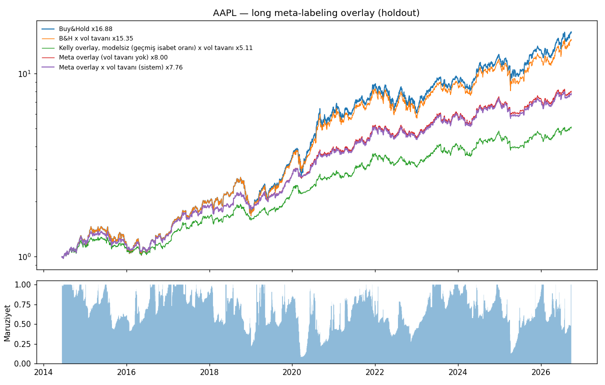

# Sonuçlar: Long meta-labeling overlay vs Buy & Hold (kilitli test)

Ön-kayıt: [`long_overlay.md`](long_overlay.md). Ön-kayıt commit'i `ab57e8f` (2026-09-27 14:53 +03), kilitli
test ondan sonra tek seferde çalıştırıldı. Parametre değişmedi. AAPL sonucu yeniden çalıştırmada birebir
tekrarlandı. Pencere: 2014-06-12 → 2026-09-25, maliyet 5 bps/yön, next_open, kaldıraç yok. Veri: yfinance
(auto_adjust). Piyasa endeksi ABD için SPY, BIST için XU100.IS. Sızıntı denetimi her hissede 33 kontrol,
0 FAIL.

| Hisse | B&H SR | Sistem SR | Modelsiz Kelly SR | B&H×vol SR | ΔSR [%95 GA] | P(Δ≤0) | Placebo p | AUC | Ort. maruziyet | B&H / Sistem CAGR | Karar |
|---|---|---|---|---|---|---|---|---|---|---|---|
| AAPL | 0.95 | 1.06 | 0.96 | 0.96 | +0.10 [-0.10, +0.30] | 0.169 | 0.070 | 0.530 | 68% | 25.9% / 18.2% | GEÇTİ (anlamlı değil) |
| MSFT | 0.95 | 0.57 | 0.97 | 0.95 | -0.37 [-0.71, -0.05] | 0.987 | 0.612 | 0.461 | 24% | 24.7% / 4.2% | GEÇEMEDİ (anlamlı kayıp) |
| JPM | 0.78 | 0.67 | 0.76 | 0.84 | -0.11 [-0.54, +0.33] | 0.724 | 0.338 | 0.512 | 30% | 18.9% / 5.7% | GEÇEMEDİ |
| XOM | 0.42 | -0.15 | -0.02 | 0.29 | -0.58 [-1.09, -0.04] | 0.980 | 0.776 | 0.475 | 13% | 8.1% / -1.2% | GEÇEMEDİ (anlamlı kayıp) |
| INTC | 0.54 | 0.18 | 0.31 | 0.41 | -0.36 [-0.74, +0.03] | 0.964 | 0.562 | 0.494 | 10% | 14.8% / 0.7% | GEÇEMEDİ (anlamlı kayıp) |
| KO | 0.62 | 0.45 | 0.52 | 0.69 | -0.17 [-0.53, +0.21] | 0.816 | 0.333 | 0.479 | 46% | 9.9% / 3.4% | GEÇEMEDİ |
| WMT | 0.74 | 0.75 | 0.72 | 0.75 | +0.00 [-0.32, +0.28] | 0.498 | 0.045 | 0.519 | 23% | 14.7% / 4.2% | GEÇTİ (anlamlı değil) |
| GE | 0.44 | 0.35 | 0.17 | 0.45 | -0.09 [-0.90, +0.69] | 0.590 | 0.194 | 0.493 | 1% | 9.5% / 0.4% | GEÇEMEDİ |
| SASA.IS | 1.17 | 0.84 | 0.82 | 1.26 | -0.33 [-0.66, -0.00] | 0.976 | 0.925 | 0.424 | 51% | 60.3% / 20.7% | GEÇEMEDİ (anlamlı kayıp) |
| THYAO.IS | 0.98 | 0.54 | 0.53 | 0.87 | -0.44 [-0.81, -0.09] | 0.992 | 0.537 | 0.503 | 49% | 35.5% / 9.1% | GEÇEMEDİ (anlamlı kayıp) |
| GARAN.IS | 0.82 | 0.53 | 0.64 | 0.79 | -0.29 [-0.66, +0.09] | 0.929 | 0.701 | 0.475 | 38% | 27.9% / 7.9% | GEÇEMEDİ |
| ASELS.IS | 1.37 | 1.48 | 1.46 | 1.46 | +0.11 [-0.11, +0.34] | 0.173 | 0.124 | 0.513 | 79% | 59.6% / 47.1% | GEÇTİ (anlamlı değil) |

Sharpe yıllıklandırılmıştır. ΔSR = Sistem − B&H, eşli durağan bootstrap (2000 tekrar, blok 20 gün).
"Ort. maruziyet" gün başına ortalama pozisyon büyüklüğüdür (B&H = %100).

## Hipotez kararları

| Hipotez | Sonuç |
|---|---|
| **H1** AAPL: Sharpe(sistem) > Sharpe(B&H) | **GEÇTİ (anlamlı değil)**: 1.06 vs 0.95, ΔSR +0.10, %95 GA [−0.10, +0.30], P = 0.17. CAGR %18.2 vs %25.9; max DD %−23.7 vs %−38.5 |
| **H2** ML katkısı (placebo p < 0.05 ve sistem > modelsiz Kelly) | **BAŞARISIZ**: AAPL placebo p = 0.070 (sistem modelsiz Kelly'den yüksek ama placebo eşiği geçilmedi). 12 hissenin 1'inde p < 0.05, şansla beklenen düzeyde. Ortalama AUC 0.49 |
| **H3** Vol tavanı: Sharpe(B&H×vol) > Sharpe(B&H) | 12 hissenin 8'inde artış, 4'ünde düşüş. AAPL'de +0.006 (ihmal edilebilir) |
| **Sağlamlık** (aynı dondurulmuş sistem) | 12 hissenin **3'ünde** nokta tahmini B&H'den iyi (AAPL, WMT, ASELS), **0'ında** anlamlı, **5'inde** anlamlı kayıp (MSFT, XOM, INTC, SASA, THYAO) |

DSR tablosu (overlay raporlarında ~1.0) Sharpe > 0 sorusunu test eder, B&H'yi geçmeyi değil. Buradaki
karar ölçütü eşli bootstrap ΔSR'dir.

## Yorum

1. **Meta-model tek hisse long işlemlerin sonucunu tahmin edemiyor.** Geliştirmede 5 varyant, kilitli
   testte 12 hisse boyunca AUC ≈ 0.49. Joubert'in dört girdi grubunun hepsi eklendiği hâlde sonuç değişmedi.
2. **AAPL'deki üstünlük sağlam değil.** Aynı sistem diğer 11 hissenin 9'unda B&H'ye yenildi. Tek
   hisseye bakıp "geçti" demek, bu hisseyi sonradan seçmek anlamına gelir.
3. **Conformal Kelly zayıf avantajda maruziyeti çok düşürüyor.** GE'de ortalama maruziyet %1, XOM'da
   %13. Kelly'nin "avantaj yoksa bahis yapma" mantığı çalışıyor. Ama ortada avantaj olmadığından sonuç
   B&H'den düşük getiri oluyor.
4. **Kalan tek olumlu bulgu vol tavanı.** 12 hissenin 8'inde Sharpe'ı artırdı, ama etki küçük ve
   işareti hisseye göre değişiyor (Cederburg vd. 2020 ile tutarlı).

Bu kilitli pencere artık tüketildi. Yeni bir tasarım bu verilerle test edilirse, sonucu bu pencerede
yapılmış bir optimizasyon olarak okunmalıdır. Temiz test için ileriye dönük (paper trading) veri gerekir.

